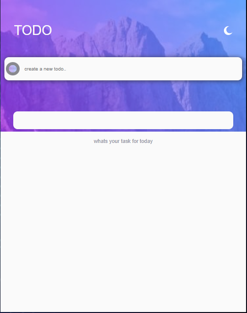

# Frontend Mentor - Todo app solution

This is a solution to the [Todo app challenge on Frontend Mentor](https://www.frontendmentor.io/challenges/todo-app-Su1_KokOW). Frontend Mentor challenges help you improve your coding skills by building realistic projects.

## Table of contents

- [Overview](#overview)
  - [The challenge](#the-challenge)
  - [Screenshot](#screenshot)
  - [Links](#links)
- [My process](#my-process)
  - [Built with](#react)
  - [What I learned](#react-state-management)
  - [Continued development](#continued-development)
  - [Useful resources](#useful-resources)
- [Author](#Akuuna Chibueze Victory)
- [Acknowledgments](#frontend-mentors)

## Overview

### The challenge

Users should be able to:

- View the optimal layout for the app depending on their device's screen size

- Add new todos to the list
- Mark todos as complete
- Delete todos from the list
- Filter by all/active/complete todos
- Clear all completed todos
- Toggle light and dark mode

### Screenshot



### Links

- Solution URL: [Add solution URL here](https://mytodo101.netlify.app)
- Live Site URL: [Add live site URL here](https://mytodo101.netlify.app)

## My process

### Built with

- Semantic HTML5 markup
- CSS custom properties
- Flexbox
- CSS Grid
- Mobile-first workflow
- [React](https://reactjs.org/) - JS library

### What I learned

react state management

```

If you want more help with writing markdown, we'd recommend checking out [The Markdown Guide](https://www.markdownguide.org/) to learn more.

**Note: Delete this note and the content within this section and replace with your own learnings.**

## Author

- Website - [Victory Akunna](https://mytodo101.netlify.app)
- Frontend Mentor - [@aviciinvestment](https://www.frontendmentor.io/profile/aviciinvestment)
- Twitter - [@aviciinvestment](https://www.twitter.com/aviciinvestment)


## Acknowledgments
frontend mentors for the wonderful UIs used for practice
```
